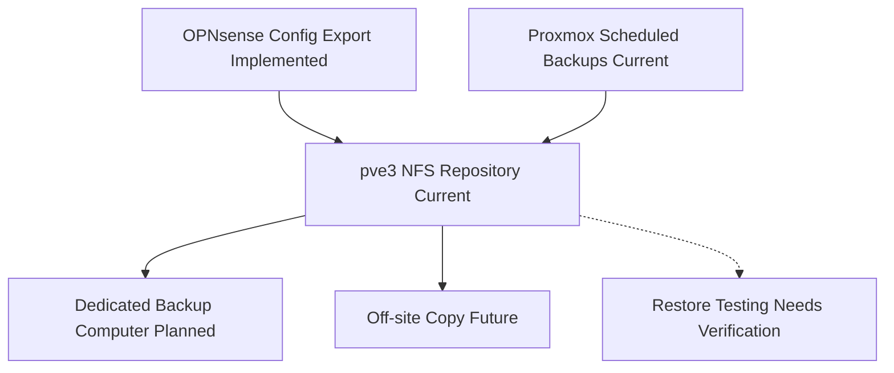

# Backup Architecture

## Purpose

Show the current and planned backup model.

## Scope

- OPNsense configuration export
- Centralized NFS backup repository on `pve3`
- Proxmox scheduled backups
- Dedicated backup computer
- Future off-site copy
- Restore testing

## Mermaid Diagram

## Explanation

The backup system now uses a centralized NFS repository exported from `pve3`, with Proxmox writing all guest backups to the same shared target.

## Assumptions

- Snapshots are not backups.
- The cluster should treat the NFS repository as the shared backup target.

## Items Needing Verification

- Restore success criteria
- Any future off-site copy details

## Related Documentation

- [`docs/infrastructure/backup-strategy.md`](../infrastructure/backup-strategy.md)
