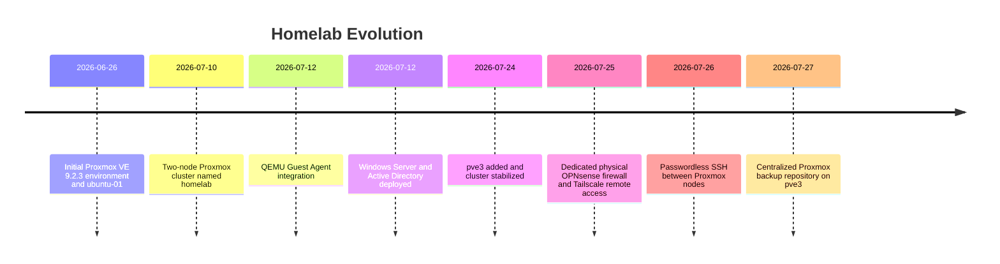

# Environment Evolution

## Purpose

Show how the homelab changed over time.

## Scope

- June 26, 2026 - Initial Proxmox and Ubuntu environment
- July 10, 2026 - Two-node cluster
- July 12, 2026 - QEMU Guest Agent
- July 12, 2026 - Windows Server and Active Directory
- July 24, 2026 - Third Proxmox node
- July 25, 2026 - OPNsense and Tailscale deployment
- July 26, 2026 - Passwordless SSH between Proxmox nodes
- July 27, 2026 - Centralized Proxmox backup repository

## Mermaid Diagram

## Explanation

The timeline emphasizes infrastructure maturity and architectural changes rather than task completion alone.

## Assumptions

- The dates provided are authoritative for the documented milestones.

## Items Needing Verification

- Any earlier pre-2026 precursor changes that are not yet documented

## Related Documentation

- [`docs/journal/`](../journal/)
