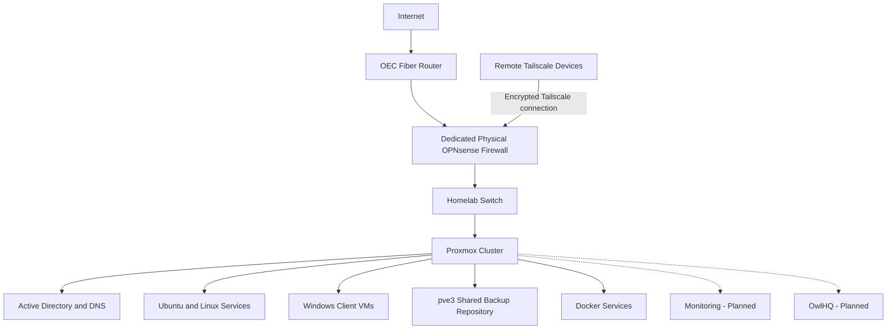

# High-Level Architecture

## Purpose

Provide a public-safe view of the homelab at a system level.

## Scope

- Internet edge
- Firewall boundary
- Proxmox cluster
- Identity services
- Backup repository
- Windows and Linux workloads
- Remote access
- Planned monitoring and application layers

## Mermaid Diagram

## Explanation

The diagram shows the firewall as the edge boundary and the Proxmox cluster as the primary compute layer beneath it.

## Assumptions

- Public documentation should not expose IP addresses.
- Monitoring and OwlHQ are planned, not yet confirmed as production services.
- The shared backup repository is current, not planned.

## Items Needing Verification

- Exact placement of some services within the cluster
- Whether monitoring is operational
- Whether OwlHQ has any deployed components

## Related Documentation

- [`docs/architecture/high-level-architecture.md`](../architecture/high-level-architecture.md)
