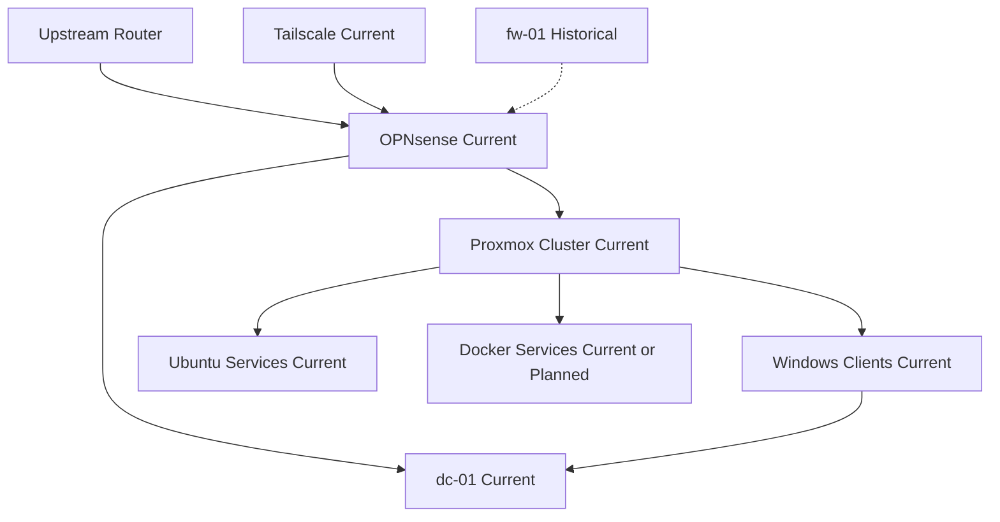

# Logical Network Topology

## Purpose

Document the logical relationships between edge routing, identity, compute, and remote access.

## Scope

- Firewall boundary
- Internal DNS
- Proxmox cluster
- Remote administration path

## Mermaid Diagram

## Explanation

The firewall is the logical boundary, DNS is rooted in the domain controller, and remote access enters through Tailscale.

## Assumptions

- `fw-01` is historical and not part of the active design.
- Some service placement details remain to be confirmed.

## Items Needing Verification

- Exact placement of `docker-01`
- Whether monitoring is active
- Whether any service depends on legacy firewall assumptions

## Related Documentation

- [`docs/architecture/logical-topology.md`](../architecture/logical-topology.md)

