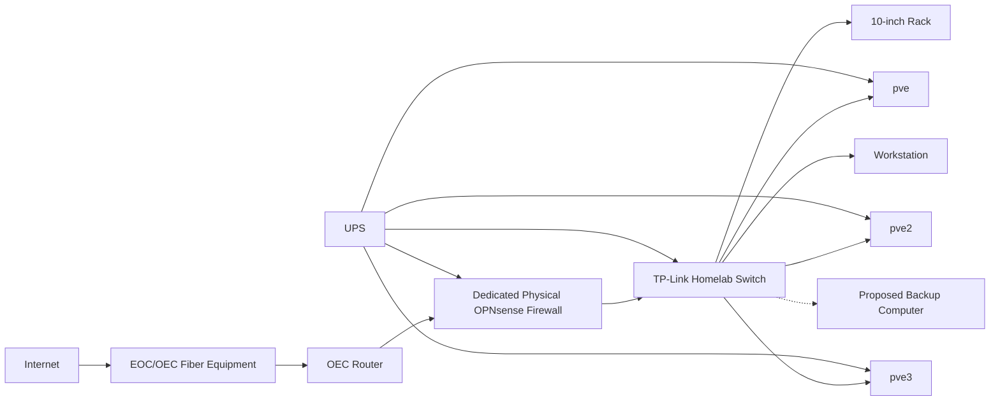

# Physical Network Topology

## Purpose

Document the physical infrastructure layout at a high level.

## Scope

- OEC Fiber equipment
- OEC router
- Dedicated OPNsense appliance
- Homelab rack and switch
- Proxmox nodes
- Workstation connection
- UPS
- Proposed backup computer

## Mermaid Diagram

## Explanation

This diagram focuses on physical connectivity and organizational layout, not precise rack units or private labels.

## Assumptions

- The unmanaged switch is the current aggregation point.
- The firewall sits outside the Proxmox cluster.

## Items Needing Verification

- Final rack placement
- Exact UPS coverage
- Backup computer deployment status

## Related Documentation

- [`docs/architecture/physical-topology.md`](../architecture/physical-topology.md)

