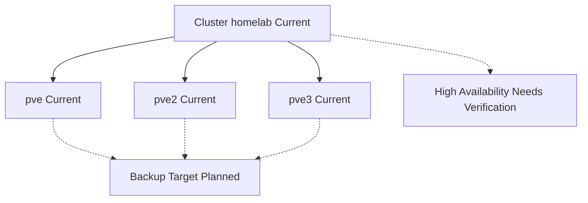

# Proxmox Cluster

## Purpose

Show the current Proxmox control-plane relationship.

## Scope

- Cluster `homelab`
- Nodes `pve`, `pve2`, and `pve3`
- Local storage only
- Known and unknown VM placement
- Planned backup destination

## Mermaid Diagram

## Explanation

The diagram intentionally avoids implying automatic failover or shared storage.

## Assumptions

- Management is centralized through the cluster.
- Storage remains node-local unless later confirmed otherwise.

## Items Needing Verification

- Final VM placement
- Backup target details
- Shared storage status

## Related Documentation

- [`docs/infrastructure/proxmox-cluster.md`](../infrastructure/proxmox-cluster.md)

