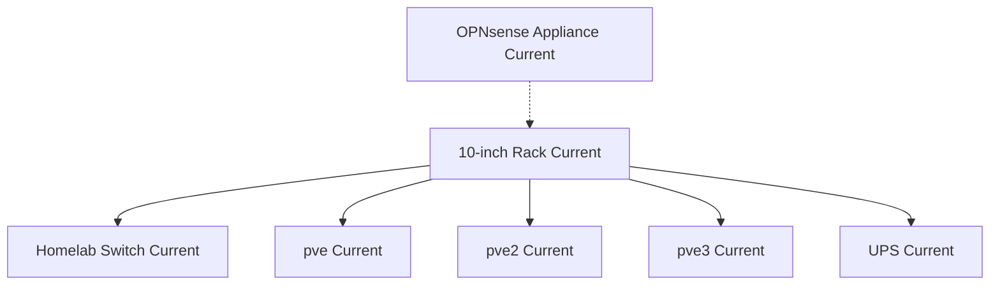

# Rack Overview

## Purpose

Provide a public-safe summary of the rack-based physical organization.

## Scope

- Rack enclosure
- Switch
- Proxmox nodes
- Supporting power gear
- External firewall appliance

## Mermaid Diagram

## Explanation

The rack organizes the compute and switching gear, while the firewall remains physically separate.

## Assumptions

- Exact rack positions are private.
- The firewall is adjacent to the rack rather than inside it.

## Items Needing Verification

- Precise rack layout
- Any future rack expansion

## Related Documentation

- [`docs/infrastructure/rack.md`](../infrastructure/rack.md)

