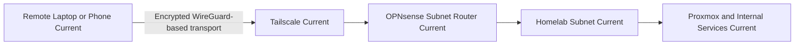

# Remote Access

## Purpose

Show the current external administration path into the homelab.

## Scope

- Remote device
- Tailscale
- OPNsense subnet routing
- Internal services

## Mermaid Diagram

## Explanation

Remote access avoids exposing individual services directly and instead enters through the firewall boundary.

## Assumptions

- Tailscale is the approved remote-access path.
- The lab remains behind the upstream router.

## Items Needing Verification

- Exit-node status
- DNS handling through Tailscale
- Any additional external access methods

## Related Documentation

- [`docs/remote-access/tailscale.md`](../remote-access/tailscale.md)

