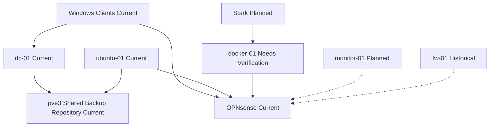

# Service Relationships

## Purpose

Show how core services depend on each other.

## Scope

- Identity
- DNS
- Workstations
- Linux administration
- Container services
- Monitoring
- Stark
- Firewall services
- Shared backup storage

## Mermaid Diagram

## Explanation

The diagram shows current dependencies and keeps planned items visibly distinct.

## Assumptions

- `monitor-01` is not yet confirmed operational.
- `docker-01` exists or is planned, but placement is not yet fully verified.
- The shared backup repository is current and supports Proxmox backups.

## Items Needing Verification

- `monitor-01` deployment state
- `docker-01` actual hosting details
- Stark deployment timeline
- Whether any additional VMs are intended to be added to backup scope

## Related Documentation

- [`docs/systems/monitoring.md`](../systems/monitoring.md)
- [`docs/applications/stark.md`](../applications/stark.md)
